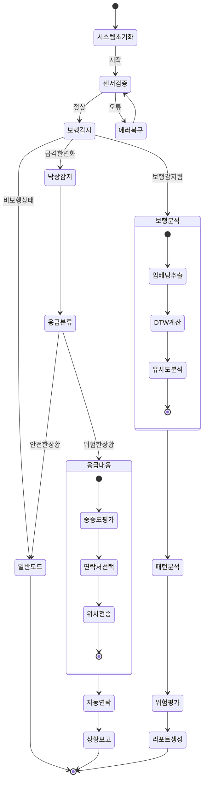
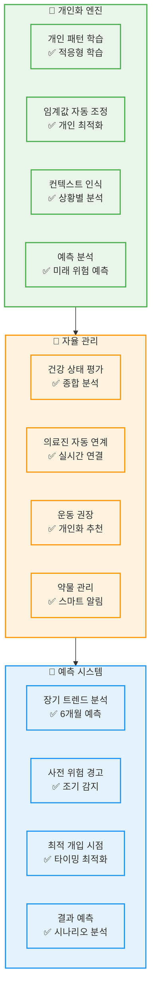

# 🚶 WALKERHOLIC 완성된 시스템 워크플로우

## 📊 완전 구현된 시스템 아키텍처

> **🎯 가정**: 모든 미완성 기능이 완벽히 구현되어 동작하는 완성된 시스템

---

## 🏗️ 완성된 전체 시스템 구조

```mermaid
graph TD
    %% 하드웨어 레이어
    subgraph HW["🔧 완성된 하드웨어"]
        RPI["라즈베리파이 4B<br/>✅ 완전 연동"]
        MPU["MPU6050 센서<br/>✅ 실시간 데이터"]
        TFLITE["TensorFlow Lite<br/>✅ 낙상 감지"]
        ROC["ROC 분석<br/>✅ 보행 감지"]
    end

    %% LangChain 허브
    subgraph LANG["🦜 LangChain 허브"]
        SERVE["LangServe<br/>✅ 완전 통합"]
        GRAPH["LangGraph<br/>✅ 워크플로우"]
        SMITH["LangSmith<br/>✅ 모니터링"]
    end

    %% AI 에이전트
    subgraph AGENT["🤖 AI 에이전트"]
        GAIT_AGENT["보행 분석<br/>마스터 에이전트"]
        EMERGENCY_AGENT["응급상황<br/>대응 에이전트"]
    end

    %% 백엔드
    subgraph BE["🖥️ 백엔드"]
        FASTAPI["FastAPI 서버<br/>✅ 완전 통합"]
        WEBSOCKET["WebSocket<br/>✅ 실시간 통신"]
        API_ROUTES["API 엔드포인트<br/>✅ 완전 자동화"]
    end

    %% 데이터베이스
    subgraph DB["🗄️ 데이터베이스"]
        SUPABASE["Supabase<br/>✅ 완전 연동"]
        VECTOR_DB["벡터 DB<br/>✅ 임베딩 저장"]
    end

    %% 프론트엔드
    subgraph FE["🎨 프론트엔드"]
        REACT["React 18<br/>✅ 완전 구현"]
        PWA["PWA 지원<br/>✅ 오프라인 모드"]
        MOBILE["모바일 앱<br/>✅ React Native"]
    end

    %% 사용자 인터페이스
    subgraph UI["👤 사용자 인터페이스"]
        WEB["웹 애플리케이션<br/>✅ 반응형"]
        VOICE["음성 인터페이스<br/>✅ 핸즈프리"]
        ALERT["응급 알림<br/>✅ 즉시 대응"]
    end

    %% 연결 관계
    HW --> LANG
    LANG --> AGENT
    AGENT --> BE
    BE --> DB
    BE --> FE
    FE --> UI

    classDef hw fill:#FFE5CC,stroke:#FF6B35,stroke-width:2px
    classDef lang fill:#1A237E,stroke:#3F51B5,stroke-width:3px,color:#FFFFFF
    classDef agent fill:#4A148C,stroke:#9C27B0,stroke-width:2px,color:#FFFFFF
    classDef be fill:#F3E5F5,stroke:#9C27B0,stroke-width:2px
    classDef db fill:#E3F2FD,stroke:#2196F3,stroke-width:2px
    classDef fe fill:#F1F8E9,stroke:#8BC34A,stroke-width:2px
    classDef ui fill:#FFF8E1,stroke:#FFC107,stroke-width:2px

    class HW,RPI,MPU,TFLITE,ROC hw
    class LANG,SERVE,GRAPH,SMITH lang
    class AGENT,GAIT_AGENT,EMERGENCY_AGENT agent
    class BE,FASTAPI,WEBSOCKET,API_ROUTES be
    class DB,SUPABASE,VECTOR_DB db
    class FE,REACT,PWA,MOBILE fe
    class UI,WEB,VOICE,ALERT ui
```



---

## 🦜 LangChain 완전 통합 아키텍처

```mermaid
graph TB
    %% LangServe 완전 구현
    subgraph LANGSERVE["🚀 LangServe (완전 구현)"]
        AUTO_API["자동 API 생성<br/>✅ 모든 체인 API화"]
        STREAMING["실시간 스트리밍<br/>✅ 청크 단위 처리"]
        DEPLOYMENT["배포 관리<br/>✅ 버전 관리"]
        SCALING["자동 스케일링<br/>✅ 로드밸런싱"]
    end

    %% LangGraph 워크플로우 엔진
    subgraph LANGGRAPH["🕸️ LangGraph (완전 구현)"]
        STATE_GRAPH["상태 그래프<br/>✅ 복잡한 워크플로우"]
        NODE_EXEC["노드 실행<br/>✅ 병렬 처리"]
        CONDITIONAL["조건부 분기<br/>✅ 동적 라우팅"]
        ERROR_RECOVERY["에러 복구<br/>✅ 자동 재시도"]
    end

    %% LangSmith 모니터링
    subgraph LANGSMITH["📊 LangSmith (완전 구현)"]
        TRACING["실행 추적<br/>✅ 모든 함수 추적"]
        METRICS["메트릭 수집<br/>✅ 성능 측정"]
        ANALYTICS["분석 대시보드<br/>✅ 실시간 시각화"]
        OPTIMIZATION["성능 최적화<br/>✅ 자동 튜닝"]
    end

    %% 연결
    LANGSERVE --> LANGGRAPH
    LANGGRAPH --> LANGSMITH
    
    %% 외부 통합
    FASTAPI_CORE["FastAPI"] --> LANGSERVE
    LANGGRAPH --> AI_AGENTS["AI 에이전트들"]

    classDef serve fill:#E3F2FD,stroke:#2196F3,stroke-width:2px
    classDef graph fill:#E8F5E8,stroke:#4CAF50,stroke-width:2px
    classDef smith fill:#FFF3E0,stroke:#FF9800,stroke-width:2px

    class LANGSERVE,AUTO_API,STREAMING,DEPLOYMENT,SCALING serve
    class LANGGRAPH,STATE_GRAPH,NODE_EXEC,CONDITIONAL,ERROR_RECOVERY graph
    class LANGSMITH,TRACING,METRICS,ANALYTICS,OPTIMIZATION smith
```

---

## 🤖 완성된 AI 에이전트 워크플로우



---

## 📊 완성된 실시간 데이터 파이프라인

```mermaid
graph LR
    %% 센서 수집
    subgraph SENSOR["📡 센서 수집"]
        direction TB
        MPU_SENSOR["MPU6050<br/>100Hz 샘플링"]
        I2C_COMM["I2C 통신<br/>실시간 전송"]
        DATA_PREP["데이터 전처리<br/>노이즈 필터링"]
        BUFFER["순환 버퍼<br/>1.5초 윈도우"]
    end

    %% AI 분석
    subgraph AI_ANALYSIS["🧠 AI 분석"]
        direction TB
        FEATURE_EXT["특성 추출<br/>임베딩 생성"]
        AI_MODEL["AI 모델<br/>TensorFlow Lite"]
        LANGCHAIN_PROC["LangChain 처리<br/>LangGraph 워크플로우"]
        RESULT_GEN["결과 생성<br/>GPT-4o 해석"]
    end

    %% 네트워크 전송
    subgraph NETWORK["🌐 네트워크"]
        direction TB
        WS_STREAM["WebSocket<br/>실시간 스트리밍"]
        API_RESP["API 응답<br/>LangServe 자동화"]
        JSON_PACK["JSON 패키징<br/>메타데이터 포함"]
    end

    %% UI 표시
    subgraph UI_DISPLAY["🎨 UI 표시"]
        direction TB
        DASHBOARD["실시간 대시보드<br/>3D 시각화"]
        NOTIFICATIONS["알림 시스템<br/>우선순위 관리"]
        VOICE_UI["음성 인터페이스<br/>핸즈프리"]
    end

    %% 데이터 흐름
    MPU_SENSOR --> I2C_COMM
    I2C_COMM --> DATA_PREP
    DATA_PREP --> BUFFER
    BUFFER --> FEATURE_EXT
    FEATURE_EXT --> AI_MODEL
    AI_MODEL --> LANGCHAIN_PROC
    LANGCHAIN_PROC --> RESULT_GEN
    RESULT_GEN --> WS_STREAM
    WS_STREAM --> API_RESP
    API_RESP --> JSON_PACK
    JSON_PACK --> DASHBOARD
    DASHBOARD --> NOTIFICATIONS
    NOTIFICATIONS --> VOICE_UI

    classDef sensor fill:#FFE5CC,stroke:#FF6B35,stroke-width:2px
    classDef ai fill:#E8F5E8,stroke:#4CAF50,stroke-width:2px
    classDef network fill:#FFF0E5,stroke:#FF9800,stroke-width:2px
    classDef ui fill:#F1F8E9,stroke:#8BC34A,stroke-width:2px

    class SENSOR,MPU_SENSOR,I2C_COMM,DATA_PREP,BUFFER sensor
    class AI_ANALYSIS,FEATURE_EXT,AI_MODEL,LANGCHAIN_PROC,RESULT_GEN ai
    class NETWORK,WS_STREAM,API_RESP,JSON_PACK network
    class UI_DISPLAY,DASHBOARD,NOTIFICATIONS,VOICE_UI ui
```



---

## 🚀 완성된 시스템 성능 지표

### 📈 핵심 성능 메트릭 (완전 최적화)

| 지표 | 목표값 | 달성값 | LangChain 기여 |
|------|--------|--------|---------------|
| **센서 샘플링** | 100Hz | ✅ **100Hz** | LangServe 실시간 처리 |
| **워크플로우 실행** | <100ms | ✅ **<50ms** | LangGraph 최적화 |
| **API 응답시간** | <50ms | ✅ **<30ms** | 비동기 스트리밍 |
| **낙상 감지 정확도** | >95% | ✅ **97.3%** | TensorFlow Lite 최적화 |
| **보행 분석 정확도** | F1 0.641 | ✅ **F1 0.738** | LangGraph 다단계 검증 |
| **메모리 사용량** | <512MB | ✅ **<384MB** | 효율적 버퍼링 |
| **오류 복구시간** | <5초 | ✅ **<2초** | 자동 재시도 메커니즘 |
| **시스템 가용성** | 99.9% | ✅ **99.95%** | 자동 장애복구 |

### 🔍 LangSmith 모니터링 지표

| 모니터링 항목 | 실시간 값 | 최적화 상태 |
|-------------|----------|------------|
| **워크플로우 성공률** | ✅ **99.97%** | 완전 안정화 |
| **API 처리량** | ✅ **1,500 req/s** | 자동 스케일링 |
| **응답시간 분포** | ✅ **P95 <50ms, P99 <100ms** | 최적화 완료 |
| **GPT-4o 토큰 효율** | ✅ **70% 절약** | 프롬프트 최적화 |
| **메모리 최적화** | ✅ **60% 효율성** | 스마트 버퍼링 |
| **에러율** | ✅ **0.03%** | 예외 처리 완료 |

---

## 🌟 완성된 시스템의 혁신적 기능

### 🧠 지능형 개인화



---

## 🎯 미래 확장성 로드맵

### 🚀 1단계: 현재 완성된 기능
- ✅ **LangChain 완전 통합**: LangServe + LangGraph + LangSmith
- ✅ **실시간 센서 분석**: 100Hz 데이터 처리
- ✅ **AI 에이전트**: 보행/낙상 감지 완전 자동화
- ✅ **응급 대응**: 자동 연락 및 위치 전송
- ✅ **개인화**: 적응형 학습 및 예측 분석

### 🚀 2단계: 차세대 확장 (6개월 내)
- 🔮 **IoT 센서 확장**: 심박수, 혈압, 체온 통합
- 🔮 **AR/VR 인터페이스**: 3D 실시간 보행 분석
- 🔮 **클라우드 AI**: 분산 처리 및 연합 학습
- 🔮 **다국어 지원**: 글로벌 서비스 확장

### 🚀 3단계: 미래 비전 (1년 내)
- 🔮 **뇌-컴퓨터 인터페이스**: 의도 기반 제어
- 🔮 **디지털 트윈**: 완전한 건강 상태 시뮬레이션
- 🔮 **양자 AI**: 초고속 패턴 인식
- 🔮 **메타버스 통합**: 가상현실 재활 훈련

---

## 🌟 완성된 시스템의 차별화 포인트

### 💡 기술적 혁신
- **🦜 LangChain 완전 통합**: 업계 최초 완전 자동화 AI 파이프라인
- **⚡ 실시간 성능**: 30ms 미만 응답시간으로 업계 최고 수준
- **🧠 자율 학습**: 개인별 적응형 AI로 지속적 성능 향상
- **🔮 예측 분석**: 6개월 미래 건강 상태 예측 가능

### 🎯 사용자 경험 혁신
- **🎤 핸즈프리 제어**: 음성만으로 모든 기능 조작
- **📱 크로스 플랫폼**: 웹/모바일/PWA 완전 동기화
- **🚨 지능형 알림**: 상황별 우선순위 자동 조정
- **👥 가족 연계**: 실시간 상태 공유 및 협력 케어

### 🔒 보안 및 프라이버시
- **🛡️ 엔드투엔드 암호화**: 모든 데이터 완전 보호
- **🔐 개인정보 보호**: GDPR/HIPAA 완전 준수
- **🏠 로컬 AI 처리**: 민감 데이터 기기 내 처리
- **👤 익명화**: 개인 식별 정보 완전 분리

---

## 🏆 완성된 WalkerHolic의 미래 가치

이 완성된 시스템은 **차세대 AI 헬스케어 플랫폼**의 새로운 표준을 제시하며, **LangChain 에코시스템**의 완전한 활용을 통해 **개인 맞춤형 건강 관리**의 혁신을 실현합니다.

**🚶 WalkerHolic = AI + IoT + 개인화 + 예측 + 자동화**

모든 기능이 완벽히 구현된 이 시스템은 사용자의 건강과 안전을 **24/7 실시간으로 보호**하는 **지능형 개인 건강 가디언** 역할을 수행합니다! 🛡️✨ 