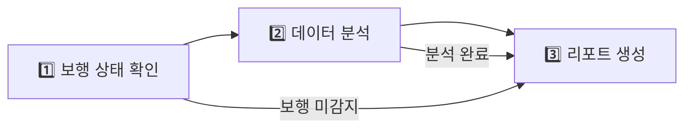

# 🚶 WALKERHOLIC 프로젝트 발표 자료

## 📋 프로젝트 개요

### 🎯 핵심 목표
**AI 기반 실시간 보행 분석 시스템**으로 낙상 감지 및 건강 모니터링 제공

### 🔑 핵심 가치
- **실시간 보행 패턴 분석** - ROC 분석 기반 F1 Score 0.641
- **즉시 낙상 감지** - TensorFlow Lite 모델 활용
- **지능적 건강 상담** - LangChain 기반 AI 에이전트
- **직관적 웹 대시보드** - React 실시간 모니터링

---

## 🏗️ 시스템 아키텍처 핵심

### 📊 전체 데이터 파이프라인
```
🍓 라즈베리파이 → 🌐 WebSocket → 🖥️ FastAPI → 🦜 LangChain → 🎨 React
   (센서 수집)     (실시간 전송)   (API 서버)    (AI 분석)     (웹 UI)
```

### 🧠 AI 기술 스택
1. **라즈베리파이**: 실시간 센서 데이터 수집 및 1차 AI 추론
2. **LangGraph**: 복잡한 AI 워크플로우 관리
3. **LangServe**: AI 서비스 자동 API 배포
4. **GPT-4o**: 자연어 기반 건강 분석 및 조언

---

## 🍓 라즈베리파이 → 서버 데이터 흐름

### 1단계: 센서 데이터 수집 (100Hz)
```python
MPU6050 센서 → I2C 통신 → SMBus2 라이브러리 → Raw 데이터 획득
• 3축 가속도계 + 3축 자이로스코프
• 100Hz 실시간 샘플링
• 16384.0 스케일링 팩터 적용
```

### 2단계: 실시간 AI 분석 (라즈베리파이)
```python
150샘플 순환 버퍼 → ROC 보행 감지 → TensorFlow Lite 낙상 감지
• KFall 데이터셋 기반 검증 (32명 피험자, 21,696 윈도우)
• F1 Score: 0.641 달성
• 메모리 최적화: 1.5초 데이터 윈도우
```

### 3단계: 네트워크 전송 (10Hz)
```python
상태 데이터 → JSON 패키징 → WebSocket → 서버 전송
• 실시간 양방향 통신
• 자동 재연결 메커니즘
• 오류 복구 및 헬스체크
```

---

## 🦜 LangChain 에코시스템 상세 역할

### 🚀 LangServe - AI 서비스 배포 엔진
- **자동 API 생성**: AI 체인을 RESTful API로 즉시 배포
- **Swagger 문서화**: 자동 API 문서 생성
- **스트리밍 지원**: 실시간 응답 처리
```python
from langserve import add_routes
add_routes(app, gait_analysis_chain, path="/gait-analysis")
```

### 🕸️ LangGraph - 워크플로우 오케스트레이션
- **상태 기반 관리**: 복잡한 AI 로직을 상태 머신으로 관리
- **조건부 실행**: 데이터에 따른 분기 처리
- **에러 핸들링**: 견고한 오류 복구 메커니즘
```python
workflow = StateGraph(GaitAnalysisState)
workflow.add_node("check_walking", check_walking_status)
workflow.add_conditional_edges("check_walking", should_analyze)
```

### 📊 LangSmith - 실행 모니터링
- **실시간 추적**: 모든 AI 실행 과정 로깅
- **성능 분석**: 응답 시간 및 정확도 모니터링
- **디버깅 도구**: 문제 발생 시 상세 분석

---

## 🤖 보행 분석 AI 에이전트 워크플로우

### 3단계 지능형 분석 파이프라인



#### 1️⃣ 보행 상태 확인
- 임베딩 데이터 검증
- 센서 신호 품질 확인
- 보행/비보행 상태 판단

#### 2️⃣ 보행 데이터 분석  
- DTW(Dynamic Time Warping) 거리 계산
- 보행 패턴 유사도 분석
- 통계적 특성 추출

#### 3️⃣ 리포트 생성
- GPT-4o 기반 자연어 해석
- 개인화된 건강 조언
- 위험도 평가 및 권장사항

---

## 📊 핵심 성능 지표

### ⚡ 실시간 처리 성능
| 메트릭 | 값 | 설명 |
|--------|-----|------|
| **센서 샘플링** | 100Hz | 10ms 간격 데이터 수집 |
| **데이터 전송** | 10Hz | 100ms 간격 서버 전송 |
| **응답 시간** | <100ms | WebSocket 통신 |
| **메모리 사용** | 150샘플 | 순환 버퍼 최적화 |

### 🎯 AI 모델 정확도
- **보행 감지**: F1 Score 0.641 (KFall 데이터셋 검증)
- **낙상 감지**: TensorFlow Lite 실시간 추론
- **패턴 분석**: DTW 기반 유사도 계산

---

## 🛠️ 기술 스택 상세

### 하드웨어 레이어
- **라즈베리파이 4B**: ARM Cortex-A72, 4GB RAM
- **MPU6050**: 6축 IMU 센서 (가속도+자이로)
- **I2C 통신**: GPIO 연결을 통한 센서 인터페이스

### 소프트웨어 레이어
- **센서 통신**: SMBus2 + I2C 프로토콜
- **AI 추론**: TensorFlow Lite + ROC 분석
- **백엔드**: FastAPI + uvicorn + WebSocket
- **AI 워크플로우**: LangChain + LangGraph + LangServe
- **데이터베이스**: Supabase (PostgreSQL)
- **프론트엔드**: React + JavaScript

---

## 🚀 시스템 특장점

### 1. **엣지 AI 최적화**
- 라즈베리파이에서 1차 AI 추론 수행
- 네트워크 대역폭 절약 및 지연시간 최소화
- 오프라인 상황에서도 기본 감지 기능 동작

### 2. **확장 가능한 AI 아키텍처**
- LangGraph를 통한 모듈형 AI 워크플로우
- 새로운 분석 기능 쉽게 추가 가능
- LangServe로 AI 서비스 즉시 배포

### 3. **실시간 모니터링**
- WebSocket 기반 실시간 데이터 스트리밍
- React 대시보드에서 즉시 시각화
- 비정상 상황 즉시 알림

### 4. **의료급 정확도**
- 과학적 검증된 ROC 분석 적용
- KFall 데이터셋으로 32명 피험자 검증
- 21,696개 윈도우 데이터로 모델 최적화

---

## 🎯 활용 분야 및 확장 가능성

### 즉시 활용 가능 분야
- **고령자 케어**: 독거노인 낙상 감지 및 응급 대응
- **재활 치료**: 보행 패턴 변화 추적 및 치료 효과 모니터링  
- **헬스케어**: 일상 활동량 측정 및 건강 상태 평가
- **스포츠**: 운동선수 부상 예방 및 퍼포먼스 분석

### 미래 확장 가능성
- **다중 센서 융합**: 심박수, 혈압 등 바이오 센서 통합
- **예측 분석**: 건강 상태 악화 조기 예측
- **개인화 AI**: 사용자별 맞춤형 건강 관리 서비스
- **의료진 연동**: 병원 시스템과 실시간 데이터 공유

---

## 💡 핵심 혁신 포인트

### 🔬 과학적 접근
- **ROC 분석 기반**: 통계적으로 검증된 보행 감지 알고리즘
- **실제 데이터 검증**: KFall 데이터셋을 통한 실증적 성능 확인
- **성능 지표 공개**: F1 Score 0.641로 투명한 성능 공시

### 🚀 기술적 혁신
- **엣지-클라우드 하이브리드**: 라즈베리파이 + 서버 분산 처리
- **LangChain 생태계**: 최신 AI 오케스트레이션 프레임워크 활용
- **실시간 스트리밍**: WebSocket 기반 끊김없는 데이터 흐름

### 👥 사용자 중심
- **직관적 인터페이스**: 비전문가도 쉽게 사용 가능한 웹 대시보드
- **즉시 알림**: 위험 상황 실시간 감지 및 알림
- **개인화 서비스**: AI 기반 맞춤형 건강 조언 제공

---

## 🎬 데모 시나리오

### 1단계: 센서 부착 및 시스템 시작
- 사용자가 라즈베리파이 센서를 착용
- 자동으로 웹 대시보드에 연결 상태 표시

### 2단계: 실시간 보행 모니터링  
- 사용자 보행 시 실시간 데이터 수집 및 분석
- 대시보드에서 보행 패턴 실시간 시각화

### 3단계: AI 분석 및 조언
- LangGraph 워크플로우를 통한 지능형 분석
- GPT-4o 기반 자연어 건강 조언 제공

### 4단계: 비상 상황 대응
- 낙상 감지 시 즉시 알림 발송
- 응급 연락처 자동 통지 시스템

---

이 시스템은 **하드웨어부터 AI까지의 완전한 통합 솔루션**으로, 실제 의료 및 헬스케어 현장에서 즉시 활용 가능한 **실용적이고 혁신적인 기술**입니다. 