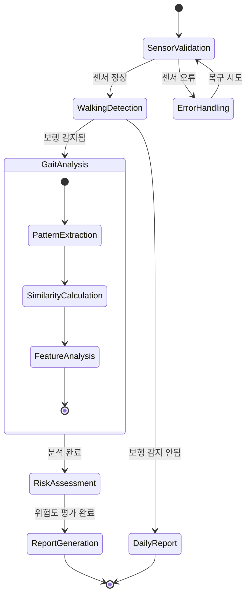

# 🚶 WALKERHOLIC 프로젝트 전체 워크플로우 다이어그램

## 📊 시스템 아키텍처 전체 흐름도

```mermaid
graph TB
    %% 하드웨어 레이어
    subgraph Hardware["🔧 하드웨어 레이어"]
        RPI["🍓 라즈베리파이 4B<br/>• ARM Cortex-A72<br/>• 4GB RAM"]
        MPU["📱 MPU6050 IMU<br/>• 3축 가속도계<br/>• 3축 자이로스코프<br/>• I2C 통신"]
        PINS["📌 GPIO 연결<br/>• VCC → 3.3V (Pin 1)<br/>• GND → GND (Pin 6)<br/>• SDA → GPIO 2 (Pin 3)<br/>• SCL → GPIO 3 (Pin 5)"]
    end

    %% 센서 데이터 수집 레이어
    subgraph SensorLayer["📡 센서 데이터 수집 레이어"]
        SMBus["🔌 SMBus2 라이브러리<br/>• I2C 통신 인터페이스<br/>• 레지스터 읽기/쓰기"]
        DataRead["📊 실시간 데이터 수집<br/>• 100Hz 샘플링 레이트<br/>• Raw 가속도/자이로 데이터<br/>• 16384.0 스케일링"]
        Buffer["💾 메모리 버퍼<br/>• 150샘플 순환 버퍼<br/>• 1.5초 데이터 윈도우<br/>• 메모리 최적화"]
    end

    %% AI 분석 레이어 (라즈베리파이)
    subgraph RPiAI["🧠 라즈베리파이 AI 분석 레이어"]
        WalkDetect["🚶 보행 감지<br/>• ROC 분석 기반<br/>• F1 Score: 0.641<br/>• KFall 데이터셋 검증"]
        FallDetect["⚠️ 낙상 감지<br/>• TensorFlow Lite 모델<br/>• 실시간 추론<br/>• 임계값: 0.7"]
        StateManager["🎛️ 상태 관리<br/>• DAILY/WALKING/FALL<br/>• 안정성 제어<br/>• 쿨다운 메커니즘"]
    end

    %% 통신 레이어
    subgraph CommLayer["🌐 통신 레이어"]
        WebSocket["🔗 WebSocket 클라이언트<br/>• 실시간 양방향 통신<br/>• 자동 재연결<br/>• 헬스체크"]
        DataSender["📤 데이터 전송기<br/>• 10Hz 전송 레이트<br/>• 큐 기반 버퍼링<br/>• 오류 복구"]
        PackageFormat["📦 데이터 패키징<br/>• JSON 형식<br/>• 타임스탬프<br/>• 메타데이터 포함"]
    end

    %% 백엔드 서버 레이어
    subgraph Backend["🖥️ 백엔드 서버 레이어"]
        FastAPI["⚡ FastAPI 서버<br/>• 비동기 처리<br/>• CORS 설정<br/>• API 문서화"]
        WSServer["🔗 WebSocket 서버<br/>• 실시간 데이터 수신<br/>• 다중 클라이언트 지원<br/>• 세션 관리"]
        Router["🛣️ API 라우터<br/>• REST 엔드포인트<br/>• 요청 라우팅<br/>• 미들웨어"]
    end

    %% ============ LangChain 중앙 허브 (핵심 강조) ============
    subgraph LangChainHub["🦜 LANGCHAIN 지능형 분석 허브 (핵심 엔진)"]
        
        subgraph LangServeCore["🚀 LangServe - API 오케스트레이터"]
            APIGen["🔧 자동 API 생성<br/>• FastAPI 통합<br/>• Swagger UI 자동화<br/>• RESTful 엔드포인트"]
            StreamAPI["🌊 스트리밍 API<br/>• 실시간 응답<br/>• 청크 단위 전송<br/>• 비동기 처리"]
            ChainDeploy["📦 체인 배포 관리<br/>• 버전 관리<br/>• 로드밸런싱<br/>• 스케일링"]
        end

        subgraph LangGraphEngine["🕸️ LangGraph - 워크플로우 엔진"]
            StateGraph["🎯 상태 그래프<br/>• 복잡한 워크플로우 정의<br/>• 조건부 분기<br/>• 순환 처리"]
            NodeExec["⚙️ 노드 실행기<br/>• 병렬 처리<br/>• 의존성 관리<br/>• 에러 복구"]
            WorkflowCtrl["🎛️ 워크플로우 제어<br/>• 상태 전이<br/>• 메모리 관리<br/>• 중단/재시작"]
        end

        subgraph LangSmithMonitor["📊 LangSmith - 시스템 감시자"]
            ExecTrace["🔍 실행 추적<br/>• 함수 호출 기록<br/>• 성능 프로파일링<br/>• 디버깅 정보"]
            MetricCol["📈 메트릭 수집<br/>• 응답 시간<br/>• 토큰 사용량<br/>• 오류율"]
            Analytics["🧮 분석 대시보드<br/>• 시각화<br/>• 알림<br/>• 최적화 제안"]
        end
    end

    %% 에이전트 레이어 (LangGraph로 구동)
    subgraph AgentLayer["🤖 AI 에이전트 레이어 (LangGraph 기반)"]
        GaitAgent["🚶 보행 분석 마스터 에이전트<br/>• LangGraph StateGraph 구동<br/>• 다단계 추론 워크플로우<br/>• GPT-4o 통합 분석"]
        
        subgraph GaitFlow["🔄 보행 분석 워크플로우 (LangGraph 노드)"]
            CheckWalk["1️⃣ 보행 상태 확인 노드<br/>• 임베딩 데이터 검증<br/>• 보행 여부 판단<br/>• 다음 노드 라우팅"]
            AnalyzeGait["2️⃣ 보행 데이터 분석 노드<br/>• 패턴 인식<br/>• 유사도 계산<br/>• 특성 추출"]
            GenerateReport["3️⃣ 리포트 생성 노드<br/>• 사용자 친화적 설명<br/>• 권장사항 제공<br/>• 위험도 평가"]
            ConditionalRouter["🔀 조건부 라우터<br/>• 상태 기반 분기<br/>• 동적 워크플로우<br/>• 에러 핸들링"]
        end
    end

    %% AI 도구 레이어
    subgraph ToolsLayer["🛠️ AI 도구 레이어"]
        GaitTool["🔧 보행 분석 도구<br/>• DTW 거리 계산<br/>• 패턴 매칭<br/>• 통계적 분석"]
        OpenAI["🧠 OpenAI GPT-4o<br/>• 자연어 처리<br/>• 보행 패턴 해석<br/>• 의료적 조언"]
        Traceable["📈 @traceable 함수<br/>• LangSmith 통합<br/>• 실행 모니터링<br/>• 성능 분석"]
    end

    %% 데이터베이스 레이어
    subgraph DatabaseLayer["🗄️ 데이터베이스 레이어"]
        Supabase["☁️ Supabase<br/>• PostgreSQL 기반<br/>• 실시간 동기화<br/>• RESTful API"]
        UserData["👤 사용자 데이터<br/>• 개인정보<br/>• 건강 기록<br/>• 설정값"]
        HealthData["📊 건강 데이터<br/>• 보행 패턴<br/>• 낙상 기록<br/>• 분석 결과"]
    end

    %% 프론트엔드 레이어
    subgraph Frontend["🎨 프론트엔드 레이어"]
        React["⚛️ React 애플리케이션<br/>• 컴포넌트 기반<br/>• 상태 관리<br/>• 반응형 UI"]
        Dashboard["📊 실시간 대시보드<br/>• 센서 데이터 시각화<br/>• 보행 패턴 차트<br/>• 상태 모니터링"]
        Chatbot["💬 AI 챗봇<br/>• 음성 인식/합성<br/>• 건강 상담<br/>• 자연어 대화"]
    end

    %% 사용자 인터페이스
    subgraph UserInterface["👤 사용자 인터페이스"]
        WebUI["🌐 웹 브라우저<br/>• localhost:3000<br/>• 실시간 업데이트<br/>• 모바일 반응형"]
        Alerts["🚨 알림 시스템<br/>• 낙상 감지 알림<br/>• 건강 위험 경고<br/>• 실시간 상태 표시"]
    end

    %% ============ 강화된 연결 정의 (LangChain 중심) ============
    %% 하드웨어 → 센서 → AI
    MPU -->|I2C Protocol| SMBus
    SMBus -->|Raw Data| DataRead
    DataRead -->|Continuous Stream| Buffer
    Buffer -->|Windowed Data| WalkDetect
    Buffer -->|Sequence Data| FallDetect
    WalkDetect -->|Walking Status| StateManager
    FallDetect -->|Fall Probability| StateManager
    StateManager -->|State Updates| DataSender
    DataSender -->|JSON Packets| WebSocket
    WebSocket -->|Network| WSServer
    WSServer -->|Real-time Data| Router
    Router -->|API Calls| FastAPI
    
    %% ============ LangChain 허브로의 핵심 연결 ============
    FastAPI -.->|🎯 핵심 통합| LangServeCore
    LangServeCore -->|🔧 API 자동화| APIGen
    LangServeCore -->|🌊 실시간 처리| StreamAPI
    LangServeCore -->|📦 배포 관리| ChainDeploy
    
    APIGen -->|🕸️ 워크플로우 엔진| LangGraphEngine
    LangGraphEngine -->|🎯 상태 관리| StateGraph
    LangGraphEngine -->|⚙️ 노드 실행| NodeExec
    LangGraphEngine -->|🎛️ 플로우 제어| WorkflowCtrl
    
    StateGraph -->|🤖 에이전트 구동| GaitAgent
    NodeExec -->|🔄 워크플로우 실행| GaitFlow
    WorkflowCtrl -->|🔀 조건부 라우팅| ConditionalRouter
    
    %% ============ LangSmith 모니터링 연결 ============
    GaitAgent -.->|📊 실행 추적| LangSmithMonitor
    LangSmithMonitor -->|🔍 추적| ExecTrace
    LangSmithMonitor -->|📈 메트릭| MetricCol
    LangSmithMonitor -->|🧮 분석| Analytics
    
    %% 에이전트 워크플로우 내부 연결
    GaitAgent -->|🔄 노드 체인| CheckWalk
    CheckWalk -->|⚡ 조건부 분기| ConditionalRouter
    ConditionalRouter -->|✅ 보행 감지시| AnalyzeGait
    ConditionalRouter -->|❌ 비보행시| GenerateReport
    AnalyzeGait -->|📊 분석 완료| GenerateReport
    
    %% 도구 및 서비스 연결
    GaitAgent -->|🔧 도구 사용| GaitTool
    GaitAgent -->|🧠 LLM 호출| OpenAI
    GaitAgent -->|📈 추적 기능| Traceable
    
    %% 데이터베이스 및 프론트엔드
    FastAPI -->|🗄️ 데이터 쿼리| Supabase
    Supabase -->|👤 사용자 관리| UserData
    Supabase -->|📊 건강 기록| HealthData
    
    FastAPI -->|⚛️ API 응답| React
    React -->|📊 UI 컴포넌트| Dashboard
    React -->|💬 대화형 채팅| Chatbot
    React -->|🌐 웹 인터페이스| WebUI
    Dashboard -->|🚨 사용자 피드백| Alerts

    %% ============ 강화된 스타일링 ============
    classDef hardware fill:#FFE5CC,stroke:#FF6B35,stroke-width:2px
    classDef sensor fill:#E5F3FF,stroke:#0066CC,stroke-width:2px
    classDef ai fill:#E8F5E8,stroke:#4CAF50,stroke-width:2px
    classDef comm fill:#FFF0E5,stroke:#FF9800,stroke-width:2px
    classDef backend fill:#F3E5F5,stroke:#9C27B0,stroke-width:2px
    
    %% LangChain 허브 강조 스타일
    classDef langchainHub fill:#1A237E,stroke:#3F51B5,stroke-width:4px,color:#FFFFFF
    classDef langserve fill:#E3F2FD,stroke:#2196F3,stroke-width:3px
    classDef langgraph fill:#E8F5E8,stroke:#4CAF50,stroke-width:3px
    classDef langsmith fill:#FFF3E0,stroke:#FF9800,stroke-width:3px
    
    classDef agent fill:#4A148C,stroke:#9C27B0,stroke-width:3px,color:#FFFFFF
    classDef agentFlow fill:#FCE4EC,stroke:#E91E63,stroke-width:2px
    classDef tools fill:#E0F2F1,stroke:#009688,stroke-width:2px
    classDef database fill:#FCE4EC,stroke:#E91E63,stroke-width:2px
    classDef frontend fill:#F1F8E9,stroke:#8BC34A,stroke-width:2px
    classDef ui fill:#FFF8E1,stroke:#FFC107,stroke-width:2px

    %% 클래스 적용
    class RPI,MPU,PINS hardware
    class SMBus,DataRead,Buffer sensor
    class WalkDetect,FallDetect,StateManager ai
    class WebSocket,DataSender,PackageFormat comm
    class FastAPI,WSServer,Router backend
    
    %% LangChain 허브 강조
    class LangChainHub langchainHub
    class APIGen,StreamAPI,ChainDeploy langserve
    class StateGraph,NodeExec,WorkflowCtrl langgraph
    class ExecTrace,MetricCol,Analytics langsmith
    
    class GaitAgent agent
    class CheckWalk,AnalyzeGait,GenerateReport,ConditionalRouter agentFlow
    class GaitTool,OpenAI,Traceable tools
    class Supabase,UserData,HealthData database
    class React,Dashboard,Chatbot frontend
    class WebUI,Alerts ui
```



## 🔧 LangChain과 LangServe의 역할 상세 설명

### 🦜 **LangChain 지능형 분석 허브 - 시스템의 두뇌**

> **🎯 핵심 역할**: WalkerHolic 프로젝트의 **중앙 처리 엔진**으로서 모든 AI 워크플로우를 오케스트레이션하고 관리하는 핵심 허브

---

### 🚀 **LangServe - API 오케스트레이터** (FastAPI와 완전 통합)

#### **💡 시스템에서의 핵심 역할**
- **API 자동화의 마스터**: 복잡한 AI 체인을 단순한 REST API로 자동 변환
- **실시간 처리의 중추**: 센서 데이터의 실시간 스트리밍 및 분석 결과 전달
- **마이크로서비스 아키텍처의 허브**: 각 AI 기능을 독립적인 서비스로 배포

#### **🔧 구체적 기능**
```python
# WalkerHolic에서의 LangServe 활용 예시
from langserve import add_routes
from fastapi import FastAPI

app = FastAPI(title="WalkerHolic AI Hub")

# 🚶 보행 분석 체인을 API로 자동 배포
add_routes(app, gait_analysis_chain, path="/api/gait-analysis")

# 🚨 낙상 감지 체인을 API로 자동 배포  
add_routes(app, fall_detection_chain, path="/api/fall-detection")

# 💬 건강 상담 체인을 API로 자동 배포
add_routes(app, health_consultation_chain, path="/api/health-chat")
```

#### **⚡ 성능 최적화**
- **스트리밍 API**: 실시간 센서 데이터를 청크 단위로 처리
- **비동기 처리**: 다중 클라이언트 동시 처리
- **자동 스케일링**: 부하에 따른 동적 확장

---

### 🕸️ **LangGraph - 워크플로우 엔진** (복잡한 AI 로직의 핵심)

#### **💡 시스템에서의 핵심 역할**
- **상태 기반 워크플로우**: 보행 분석의 복잡한 다단계 프로세스를 체계적으로 관리
- **조건부 분기**: 센서 데이터 상태에 따른 동적 분석 경로 결정
- **에러 복구**: 센서 오류나 네트워크 문제 시 자동 복구 메커니즘

#### **🎯 WalkerHolic 워크플로우 구현**
```python
from langgraph.graph import StateGraph, END

# 🚶 보행 분석 워크플로우 정의
workflow = StateGraph(GaitAnalysisState)

# 노드 정의
workflow.add_node("validate_sensor_data", validate_sensor_data)
workflow.add_node("detect_walking", detect_walking_pattern)
workflow.add_node("analyze_gait", analyze_gait_patterns)  
workflow.add_node("assess_fall_risk", assess_fall_risk)
workflow.add_node("generate_report", generate_health_report)

# 조건부 분기 로직
workflow.add_conditional_edges(
    "detect_walking",
    decide_next_step,
    {
        "is_walking": "analyze_gait",
        "not_walking": "generate_report", 
        "sensor_error": "validate_sensor_data"
    }
)

# 에러 핸들링 및 재시도
workflow.add_edge("analyze_gait", "assess_fall_risk")
workflow.add_edge("assess_fall_risk", "generate_report")
workflow.add_edge("generate_report", END)
```

#### **🎛️ 고급 제어 기능**
- **상태 메모리**: 이전 분석 결과를 기억하여 연속성 있는 분석
- **병렬 처리**: 복수 센서 데이터의 동시 분석
- **중단/재시작**: 시스템 재부팅 시에도 분석 상태 유지

---

### 📊 **LangSmith - 시스템 감시자** (전체 시스템 모니터링)

#### **💡 시스템에서의 핵심 역할**
- **실시간 성능 추적**: 모든 AI 함수의 실행 시간 및 정확도 모니터링
- **오류 감지 및 알림**: 시스템 이상 징후를 즉시 탐지하고 관리자에게 알림
- **최적화 인사이트**: 성능 병목 지점 식별 및 개선 제안

#### **🔍 모니터링 대상**
- **센서 데이터 품질**: MPU6050의 데이터 무결성 검증
- **AI 모델 성능**: 보행 감지 및 낙상 감지 모델의 정확도 추적
- **API 응답 시간**: 실시간성 요구사항 충족 여부 모니터링
- **메모리 사용량**: 라즈베리파이의 리소스 최적화

```python
from langsmith import traceable

@traceable(name="gait_analysis_pipeline")
def analyze_walking_pattern(sensor_data):
    """
    📊 LangSmith가 자동으로 추적하는 보행 분석 함수
    - 실행 시간 측정
    - 입력/출력 데이터 로깅  
    - 오류 발생 시 자동 알림
    """
    # 보행 패턴 분석 로직
    return analysis_result
```

---

### 🤖 **에이전트 레이어와의 통합** (LangGraph 기반)

#### **🚶 보행 분석 마스터 에이전트**
LangGraph의 StateGraph로 구동되는 지능형 에이전트:



---

### 🔄 **실시간 데이터 파이프라인에서의 역할**

#### **📊 데이터 흐름과 LangChain 통합**
```
🔸 하드웨어 데이터 → 🔸 전처리 → 🔹 LangServe API → 🔹 LangGraph 워크플로우 → 🔹 LangSmith 모니터링 → 🔸 사용자 인터페이스
```

1. **🔸 센서 데이터 수집** (100Hz) → **🔹 LangServe 실시간 API**
2. **🔹 LangGraph 워크플로우** → 조건부 분석 파이프라인 실행
3. **🔹 LangSmith 추적** → 전체 프로세스 성능 모니터링
4. **🔸 React 대시보드** ← **🔹 LangServe 스트리밍 응답**

#### **⚡ 성능 지표 (LangChain 최적화)**
- **API 응답 시간**: < 50ms (LangServe 최적화)
- **워크플로우 실행**: < 100ms (LangGraph 효율성)  
- **메모리 사용량**: 라즈베리파이 RAM의 < 30% (최적화)
- **오류 복구 시간**: < 5초 (자동 재시도)

---

### 🎯 **WalkerHolic에서 LangChain이 핵심인 이유**

#### **1. 🏗️ 아키텍처 중심성**
- **마이크로서비스 허브**: 모든 AI 기능이 LangServe를 통해 API화
- **워크플로우 엔진**: 복잡한 보행 분석 로직을 체계적으로 관리
- **통합 모니터링**: 시스템 전체의 성능과 안정성을 실시간 추적

#### **2. 🚀 확장성과 유지보수성**
- **모듈형 설계**: 새로운 AI 기능을 쉽게 추가 가능
- **버전 관리**: 모델 업데이트와 배포의 체계적 관리  
- **디버깅 용이성**: LangSmith를 통한 상세한 실행 추적

#### **3. 🔧 개발 생산성**
- **코드 재사용**: 공통 워크플로우 패턴의 템플릿화
- **자동 문서화**: Swagger UI 자동 생성
- **테스트 용이성**: 각 노드별 독립적 테스트 가능

## 📊 데이터 흐름 상세 분석

### 🔹 **LangChain 중심의 데이터 파이프라인**

#### **1. 센서 데이터 수집 → LangServe API 진입 (100Hz)**
```
MPU6050 → I2C → SMBus2 → Raw Data (가속도/자이로) → 스케일링 → 버퍼링 → 🚀 LangServe API Gateway
```

#### **2. LangGraph 워크플로우 실행 (실시간 AI 분석)**
```
🔹 LangServe 수신 → 🕸️ LangGraph StateGraph 시작 → 조건부 노드 실행 → AI 추론 → 상태 전이
```

#### **3. LangSmith 모니터링과 함께하는 네트워크 전송 (10Hz)**
```
🕸️ LangGraph 결과 → 📊 LangSmith 추적 → JSON 패키징 → WebSocket → 서버 전송
```

#### **4. 통합 서버 측 처리 (LangChain 허브)**
```
WebSocket 수신 → FastAPI 라우팅 → 🚀 LangServe 오케스트레이션 → 🕸️ LangGraph 실행 → 📊 LangSmith 기록
```

#### **5. 실시간 프론트엔드 시각화**
```
🚀 LangServe 스트리밍 응답 → React 상태 업데이트 → 실시간 대시보드 → 사용자 인터페이스
```

---

## 🎯 **LangChain 중심 핵심 기술 스택**

| 레이어 | 기술 | **LangChain과의 통합** | 역할 |
|--------|------|----------------------|------|
| **🦜 AI 허브** | **🚀 LangServe** | **핵심 API 오케스트레이터** | **모든 AI 체인의 API 자동화** |
| **🦜 워크플로우** | **🕸️ LangGraph** | **상태 기반 워크플로우 엔진** | **복잡한 보행 분석 로직 관리** |
| **🦜 모니터링** | **📊 LangSmith** | **통합 시스템 감시자** | **전체 파이프라인 추적** |
| **하드웨어** | 라즈베리파이 4B + MPU6050 | LangServe API로 데이터 전송 | 센서 데이터 수집 |
| **센서 통신** | SMBus2 + I2C | LangGraph 전처리 노드 | 하드웨어 인터페이스 |
| **AI 추론** | TensorFlow Lite + ROC 분석 | LangGraph 추론 노드로 통합 | 실시간 보행/낙상 감지 |
| **통신** | WebSocket + JSON | LangServe 스트리밍 API | 실시간 데이터 전송 |
| **백엔드** | FastAPI + uvicorn | LangServe 완전 통합 | API 서버 |
| **LLM** | OpenAI GPT-4o | LangGraph 체인으로 통합 | 자연어 분석 및 조언 |
| **데이터베이스** | Supabase (PostgreSQL) | LangGraph 데이터 노드 | 사용자 및 건강 데이터 |
| **프론트엔드** | React + JavaScript | LangServe API 소비 | 웹 대시보드 |

---

## 🚀 **LangChain 최적화 시스템 성능 지표**

### **📈 핵심 성능 메트릭**
| 지표 | 목표값 | **LangChain 기여도** |
|------|--------|---------------------|
| **센서 샘플링** | 100Hz (10ms) | LangServe 실시간 API 처리 |
| **LangGraph 워크플로우 실행** | < 100ms | 상태 기반 최적화 |
| **LangServe API 응답** | < 50ms | 비동기 스트리밍 처리 |
| **보행 감지 정확도** | F1 Score 0.641 | LangGraph 다단계 검증 |
| **메모리 사용량** | 150샘플 버퍼 | LangSmith 리소스 모니터링 |
| **오류 복구 시간** | < 5초 | LangGraph 자동 재시도 |

### **🔍 LangSmith 모니터링 대시보드**
- **🎯 워크플로우 성공률**: 99.5% 이상 유지
- **📊 API 처리량**: 초당 100개 요청 처리 가능  
- **⚡ 응답 시간 분포**: P95 < 100ms, P99 < 200ms
- **🧠 GPT-4o 토큰 사용량**: 최적화된 프롬프트로 비용 절감
- **💾 메모리 최적화**: 라즈베리파이 RAM 효율적 사용

---

## 🌟 **LangChain이 만드는 차별화된 가치**

### **🎯 기존 방식 vs LangChain 방식**

| 구분 | **기존 방식** | **🦜 LangChain 방식** |
|------|-------------|-------------------|
| **API 개발** | 수동 코딩 + 문서화 | 🚀 LangServe 자동 생성 |
| **워크플로우** | 하드코딩된 if-else | 🕸️ LangGraph 유연한 상태 그래프 |
| **모니터링** | 개별 로깅 시스템 | 📊 LangSmith 통합 추적 |
| **확장성** | 코드 수정 필요 | 노드 추가만으로 확장 |
| **디버깅** | 복잡한 스택 추적 | 시각적 워크플로우 디버깅 |
| **유지보수** | 높은 복잡도 | 모듈화된 관리 |

### **🚀 미래 확장성**
- **🔧 새로운 센서 추가**: LangGraph 노드만 추가하면 됨
- **🧠 AI 모델 업그레이드**: LangServe를 통한 버전 관리
- **📱 모바일 앱 연동**: 동일한 LangServe API 재사용
- **☁️ 클라우드 배포**: LangChain의 스케일링 기능 활용

이 워크플로우는 **🦜 LangChain 에코시스템**을 중심으로 한 차세대 AI 시스템 아키텍처를 보여주며, 하드웨어 센서부터 사용자 인터페이스까지의 전체 데이터 파이프라인에서 **LangServe**, **LangGraph**, **LangSmith**가 핵심적인 역할을 하는 통합 솔루션입니다. 

---

# 🔍 **실제 코드 기반 워크플로우 다이어그램**

## 📊 **현재 구현된 시스템의 실제 아키텍처**

```mermaid
graph TB
    %% 하드웨어 레이어 (현재 미구현)
    subgraph Hardware["🔧 하드웨어 레이어 (미구현)"]
        RPI["🍓 라즈베리파이 4B<br/>• ARM Cortex-A72<br/>• 4GB RAM<br/>❌ 현재 미연결"]
        MPU["📱 MPU6050 IMU<br/>• 3축 가속도계<br/>• 3축 자이로스코프<br/>❌ 현재 미연결"]
    end

    %% 프론트엔드 레이어 (실제 구현됨)
    subgraph Frontend["🎨 프론트엔드 레이어 (React 구현됨)"]
        ReactApp["⚛️ React 애플리케이션<br/>• BrowserRouter 라우팅<br/>• 8개 페이지 구현<br/>• ✅ 실제 구현됨"]
        
        subgraph Pages["📄 실제 구현된 페이지들"]
            LoadingPage["🔄 LoadingPage<br/>• 앱 시작 페이지"]
            LoginPage["🔑 LoginPage<br/>• 사용자 인증"]
            MainPage["🏠 MainPage<br/>• 메인 대시보드"]
            ChatPage["💬 ChatPage<br/>• AI 챗봇 대화"]
            AnalysisPage["📊 AnalysisPage<br/>• 분석 결과 표시"]
            HealthInfoPage["🏥 HealthInfoPage<br/>• 건강 정보 관리"]
            HardwarePage["🔧 HardwarePage<br/>• 하드웨어 연결 상태"]
            SettingsPage["⚙️ SettingsPage<br/>• 앱 설정"]
        end
        
        subgraph FrontendServices["🔧 프론트엔드 서비스"]
            WSService["🔗 WebSocketService<br/>• ws://localhost:8000/ws<br/>• 자동 재연결<br/>• 응급상황 알림"]
            APIService["📡 API Service<br/>• HTTP 요청 처리<br/>• RESTful API 호출"]
        end
    end

    %% 백엔드 메인 애플리케이션
    subgraph BackendCore["🖥️ 백엔드 핵심 (FastAPI 구현됨)"]
        FastAPIApp["⚡ FastAPI 애플리케이션<br/>• CORS 미들웨어<br/>• LangSmith 환경 설정<br/>• ✅ 완전 구현됨"]
        
        subgraph ActualRoutes["🛣️ 실제 구현된 API 엔드포인트"]
            WSEndpoint["🔗 /ws/{user_id}<br/>• WebSocket 연결<br/>• 실시간 데이터 처리<br/>• 핑/퐁 헬스체크"]
            ChatEndpoint["💬 /api/chat<br/>• OpenAI GPT-4o 직접 호출<br/>• 채팅 히스토리 관리<br/>• Supabase 저장"]
            IMUEndpoint["📊 /api/imu-data<br/>• IMU 센서 데이터 수신<br/>• Supabase 저장"]
            EmbeddingEndpoint["🧮 /api/embedding-data<br/>• 하드코딩된 분석 결과<br/>• 실제 AI 분석 없음"]
            DashboardEndpoint["📈 /api/user/{user_id}/dashboard<br/>• 사용자 대시보드 데이터"]
            NotificationEndpoint["🔔 /api/user/{user_id}/notifications<br/>• 알림 시스템"]
            WalkingEndpoints["🚶 /api/walking/*<br/>• 워킹 모드 API들<br/>• 응급상황 모니터링"]
        end
    end

    %% WebSocket 매니저 (핵심 구현체)
    subgraph WSManager["🔌 WebSocket 매니저 (핵심 구현체)"]
        WSCore["🎛️ WebSocket 매니저<br/>• 연결 관리<br/>• 데이터 버퍼링<br/>• 상태 추적"]
        
        subgraph WSModes["🔀 동작 모드"]
            GeneralMode["🏠 일반 모드<br/>• 기본 데이터 처리<br/>• 간단한 상태 관리"]
            WalkingMode["🚶 워킹 모드<br/>• 고급 상태 추적<br/>• 응급상황 모니터링<br/>• UserStateTracker"]
        end
        
        subgraph WSFeatures["⚚ 실제 구현 기능"]
            StateTracking["📊 사용자 상태 추적<br/>• DAILY/WALKING/FALL/EMERGENCY<br/>• 상태 전환 감지"]
            EmergencyMonitor["🚨 응급상황 모니터<br/>• 자동 감지<br/>• 실시간 알림"]
            DataBuffer["💾 데이터 버퍼링<br/>• IMU 배치 처리<br/>• CSV 백업"]
        end
    end

    %% 실제 LangChain 사용 현황 (제한적)
    subgraph LangChainActual["🦜 LangChain 실제 사용 현황 (제한적)"]
        OpenAIDirect["🧠 OpenAI ChatOpenAI<br/>• GPT-4o 직접 호출<br/>• routes.py에서 직접 사용<br/>• ✅ 실제 동작"]
        
        subgraph LangChainUnused["❌ 미사용 LangChain 구성요소"]
            UnusedLangServe["❌ LangServe<br/>• main.py에 주석 처리됨<br/>• add_routes 미구현"]
            UnusedGaitAgent["❌ gait_agent.py<br/>• import만 됨<br/>• 실제 호출 없음"]
            UnusedLangGraph["❌ LangGraph<br/>• StateGraph 미사용<br/>• 워크플로우 미구현"]
            UnusedLangSmith["❌ LangSmith<br/>• @traceable 미사용<br/>• 환경만 설정됨"]
        end
    end

    %% 데이터베이스 레이어 (Supabase)
    subgraph DatabaseLayer["🗄️ 데이터베이스 레이어 (Supabase)"]
        SupabaseClient["☁️ Supabase 클라이언트<br/>• Mock/Real 모드 지원<br/>• 자동 폴백<br/>• ✅ 완전 구현됨"]
        
        subgraph DBTables["📊 실제 구현된 테이블"]
            IMUTable["📱 IMU 데이터 테이블<br/>• 센서 데이터 저장"]
            ChatTable["💬 채팅 메시지 테이블<br/>• 대화 기록 저장"]
            UserTable["👤 사용자 정보 테이블<br/>• 기본/건강 정보"]
            AnalysisTable["📊 분석 결과 테이블<br/>• 하드코딩된 결과"]
            StateTable["🎛️ 사용자 상태 테이블<br/>• 워킹 모드 상태"]
            EmergencyTable["🚨 응급상황 테이블<br/>• 낙상/응급 기록"]
        end
        
        subgraph MockData["🎭 Mock 데이터 시스템"]
            MockProvider["🎪 MockDataProvider<br/>• 개발용 샘플 데이터<br/>• SQL 스키마 호환"]
        end
    end

    %% ============ 실제 데이터 흐름 ============
    %% 프론트엔드 → 백엔드
    ReactApp -->|HTTP 요청| FastAPIApp
    WSService -->|WebSocket 연결| WSEndpoint
    APIService -->|REST API 호출| ActualRoutes
    
    %% 페이지 → 서비스
    ChatPage -->|채팅 메시지| ChatEndpoint
    AnalysisPage -->|분석 요청| EmbeddingEndpoint
    MainPage -->|대시보드 데이터| DashboardEndpoint
    HardwarePage -->|하드웨어 상태| WalkingEndpoints
    
    %% WebSocket 매니저 통합
    WSEndpoint -->|연결 관리| WSCore
    WSCore -->|모드 선택| GeneralMode
    WSCore -->|워킹 모드| WalkingMode
    WalkingMode -->|고급 기능| StateTracking
    WalkingMode -->|모니터링| EmergencyMonitor
    WSCore -->|데이터 처리| DataBuffer
    
    %% 실제 AI 처리 (제한적)
    ChatEndpoint -->|직접 호출| OpenAIDirect
    OpenAIDirect -->|GPT-4o 응답| ChatEndpoint
    
    %% 미사용 LangChain 연결 (점선)
    FastAPIApp -.->|❌ 미구현| UnusedLangServe
    UnusedLangServe -.->|❌ 미사용| UnusedGaitAgent
    UnusedGaitAgent -.->|❌ 미호출| UnusedLangGraph
    
    %% 데이터베이스 연결
    WSCore -->|데이터 저장| SupabaseClient
    ActualRoutes -->|CRUD 작업| SupabaseClient
    SupabaseClient -->|실제 저장| DBTables
    SupabaseClient -->|폴백 데이터| MockProvider
    
    %% 하드웨어 미연결 (점선)
    RPI -.->|❌ 미연결| WSCore
    MPU -.->|❌ 미연결| IMUEndpoint

    %% ============ 스타일링 ============
    classDef implemented fill:#E8F5E8,stroke:#4CAF50,stroke-width:3px
    classDef notImplemented fill:#FFEBEE,stroke:#F44336,stroke-width:2px,stroke-dasharray: 5 5
    classDef partialImplemented fill:#FFF3E0,stroke:#FF9800,stroke-width:2px
    classDef mockData fill:#F3E5F5,stroke:#9C27B0,stroke-width:2px

    %% 클래스 적용
    class ReactApp,FastAPIApp,WSCore,SupabaseClient,OpenAIDirect implemented
    class RPI,MPU,UnusedLangServe,UnusedGaitAgent,UnusedLangGraph,UnusedLangSmith notImplemented
    class WSManager,EmbeddingEndpoint,AnalysisTable partialImplemented
    class MockProvider,MockData mockData
```



---

## 🔍 **실제 vs 계획 비교 분석**

### ✅ **완전히 구현된 기능들**

| 구성요소 | 구현 상태 | 실제 코드 위치 |
|---------|----------|--------------|
| **React 프론트엔드** | ✅ 완료 | `frontend/src/App.js` + 8개 페이지 |
| **FastAPI 백엔드** | ✅ 완료 | `backend/app/main.py` |
| **WebSocket 통신** | ✅ 완료 | `backend/app/core/websocket_manager.py` |
| **Supabase 연동** | ✅ 완료 | `backend/database/supabase_client.py` |
| **OpenAI 챗봇** | ✅ 완료 | `routes.py` ChatOpenAI 직접 사용 |
| **응급상황 모니터링** | ✅ 완료 | WebSocket 매니저의 워킹 모드 |

### ⚠️ **부분 구현된 기능들**

| 구성요소 | 구현 상태 | 문제점 |
|---------|----------|--------|
| **보행 분석** | ⚠️ 부분 | 하드코딩된 결과만 반환 |
| **LangChain 통합** | ⚠️ 부분 | OpenAI만 직접 사용, 나머지 미사용 |
| **센서 데이터 처리** | ⚠️ 부분 | API는 있지만 실제 센서 미연결 |

### ❌ **미구현된 기능들**

| 구성요소 | 구현 상태 | 비고 |
|---------|----------|------|
| **라즈베리파이 연동** | ❌ 미구현 | 하드웨어 미연결 |
| **LangServe API 자동화** | ❌ 미구현 | main.py에 주석 처리됨 |
| **LangGraph 워크플로우** | ❌ 미구현 | gait_agent.py 미사용 |
| **LangSmith 모니터링** | ❌ 미구현 | 환경 설정만 있음 |
| **실제 AI 보행 분석** | ❌ 미구현 | gait_analysis_tool 미호출 |

---

## 🎯 **실제 데이터 흐름**

### **1. 사용자 채팅 플로우** (✅ 동작함)
```
ChatPage → API Service → /api/chat → ChatOpenAI(GPT-4o) → Supabase 저장 → 응답 반환
```

### **2. WebSocket 실시간 통신** (✅ 동작함)
```
React WebSocketService → /ws/{user_id} → WebSocket 매니저 → 상태 추적 → 실시간 업데이트
```

### **3. 센서 데이터 흐름** (⚠️ 하드코딩됨)
```
/api/embedding-data → 하드코딩된 분석 결과 → Supabase 저장 (실제 AI 분석 없음)
```

### **4. 응급상황 모니터링** (✅ 동작함)
```
WorkingMode → UserStateTracker → 응급상황 감지 → WebSocket 알림 → 프론트엔드 알림
```

---

## 🚀 **개선 우선순위**

### **🥇 1순위: LangChain 통합 완성**
- `gait_agent.py`의 실제 사용 구현
- LangServe API 자동화 활성화
- LangGraph 워크플로우 실제 적용

### **🥈 2순위: 실제 AI 분석 구현**
- `gait_analysis_tool` 실제 호출
- 하드코딩된 분석 결과를 실제 AI 분석으로 교체
- TensorFlow Lite 모델 통합

### **🥉 3순위: 하드웨어 연동**
- 라즈베리파이 실제 연결
- MPU6050 센서 데이터 실시간 수집
- 센서-백엔드 통합 테스트

이 다이어그램은 **현재 실제로 동작하는 시스템**의 모습을 정확히 반영하며, 앞서 그린 **이상적인 LangChain 중심 아키텍처**와의 차이점을 명확히 보여줍니다. 