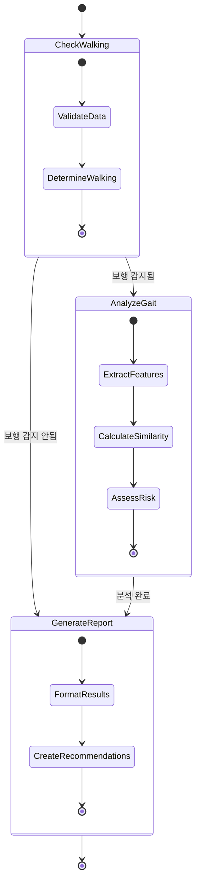

# 🚶 WALKERHOLIC 프로젝트 전체 워크플로우 다이어그램

## 📊 시스템 아키텍처 전체 흐름도

```mermaid
graph TB
    %% 하드웨어 레이어
    subgraph Hardware["🔧 하드웨어 레이어"]
        RPI["🍓 라즈베리파이 4B<br/>• ARM Cortex-A72<br/>• 4GB RAM"]
        MPU["📱 MPU6050 IMU<br/>• 3축 가속도계<br/>• 3축 자이로스코프<br/>• I2C 통신"]
        PINS["📌 GPIO 연결<br/>• VCC → 3.3V (Pin 1)<br/>• GND → GND (Pin 6)<br/>• SDA → GPIO 2 (Pin 3)<br/>• SCL → GPIO 3 (Pin 5)"]
    end

    %% 센서 데이터 수집 레이어
    subgraph SensorLayer["📡 센서 데이터 수집 레이어"]
        SMBus["🔌 SMBus2 라이브러리<br/>• I2C 통신 인터페이스<br/>• 레지스터 읽기/쓰기"]
        DataRead["📊 실시간 데이터 수집<br/>• 100Hz 샘플링 레이트<br/>• Raw 가속도/자이로 데이터<br/>• 16384.0 스케일링"]
        Buffer["💾 메모리 버퍼<br/>• 150샘플 순환 버퍼<br/>• 1.5초 데이터 윈도우<br/>• 메모리 최적화"]
    end

    %% AI 분석 레이어 (라즈베리파이)
    subgraph RPiAI["🧠 라즈베리파이 AI 분석 레이어"]
        WalkDetect["🚶 보행 감지<br/>• ROC 분석 기반<br/>• F1 Score: 0.641<br/>• KFall 데이터셋 검증"]
        FallDetect["⚠️ 낙상 감지<br/>• TensorFlow Lite 모델<br/>• 실시간 추론<br/>• 임계값: 0.7"]
        StateManager["🎛️ 상태 관리<br/>• DAILY/WALKING/FALL<br/>• 안정성 제어<br/>• 쿨다운 메커니즘"]
    end

    %% 통신 레이어
    subgraph CommLayer["🌐 통신 레이어"]
        WebSocket["🔗 WebSocket 클라이언트<br/>• 실시간 양방향 통신<br/>• 자동 재연결<br/>• 헬스체크"]
        DataSender["📤 데이터 전송기<br/>• 10Hz 전송 레이트<br/>• 큐 기반 버퍼링<br/>• 오류 복구"]
        PackageFormat["📦 데이터 패키징<br/>• JSON 형식<br/>• 타임스탬프<br/>• 메타데이터 포함"]
    end

    %% 백엔드 서버 레이어
    subgraph Backend["🖥️ 백엔드 서버 레이어"]
        FastAPI["⚡ FastAPI 서버<br/>• 비동기 처리<br/>• CORS 설정<br/>• API 문서화"]
        WSServer["🔗 WebSocket 서버<br/>• 실시간 데이터 수신<br/>• 다중 클라이언트 지원<br/>• 세션 관리"]
        Router["🛣️ API 라우터<br/>• REST 엔드포인트<br/>• 요청 라우팅<br/>• 미들웨어"]
    end

    %% LangChain 레이어
    subgraph LangChainLayer["🦜 LangChain 에코시스템"]
        LangServe["🚀 LangServe<br/>• API 자동 생성<br/>• 체인 배포<br/>• RESTful 인터페이스"]
        LangGraph["🕸️ LangGraph<br/>• 워크플로우 엔진<br/>• 상태 관리<br/>• 조건부 실행"]
        LangSmith["📊 LangSmith<br/>• 실행 추적<br/>• 성능 모니터링<br/>• 디버깅 도구"]
    end

    %% 에이전트 레이어
    subgraph AgentLayer["🤖 AI 에이전트 레이어"]
        GaitAgent["🚶 보행 분석 에이전트<br/>• LangGraph 기반<br/>• 상태 기반 워크플로우<br/>• GPT-4o 통합"]
        
        subgraph GaitFlow["🔄 보행 분석 워크플로우"]
            CheckWalk["1️⃣ 보행 상태 확인<br/>• 임베딩 데이터 검증<br/>• 보행 여부 판단"]
            AnalyzeGait["2️⃣ 보행 데이터 분석<br/>• 패턴 인식<br/>• 유사도 계산<br/>• 특성 추출"]
            GenerateReport["3️⃣ 리포트 생성<br/>• 사용자 친화적 설명<br/>• 권장사항 제공<br/>• 위험도 평가"]
        end
    end

    %% AI 도구 레이어
    subgraph ToolsLayer["🛠️ AI 도구 레이어"]
        GaitTool["🔧 보행 분석 도구<br/>• DTW 거리 계산<br/>• 패턴 매칭<br/>• 통계적 분석"]
        OpenAI["🧠 OpenAI GPT-4o<br/>• 자연어 처리<br/>• 보행 패턴 해석<br/>• 의료적 조언"]
        Traceable["📈 추적 가능한 함수<br/>• @traceable 데코레이터<br/>• 실행 모니터링<br/>• 성능 분석"]
    end

    %% 데이터베이스 레이어
    subgraph DatabaseLayer["🗄️ 데이터베이스 레이어"]
        Supabase["☁️ Supabase<br/>• PostgreSQL 기반<br/>• 실시간 동기화<br/>• RESTful API"]
        UserData["👤 사용자 데이터<br/>• 개인정보<br/>• 건강 기록<br/>• 설정값"]
        HealthData["📊 건강 데이터<br/>• 보행 패턴<br/>• 낙상 기록<br/>• 분석 결과"]
    end

    %% 프론트엔드 레이어
    subgraph Frontend["🎨 프론트엔드 레이어"]
        React["⚛️ React 애플리케이션<br/>• 컴포넌트 기반<br/>• 상태 관리<br/>• 반응형 UI"]
        Dashboard["📊 실시간 대시보드<br/>• 센서 데이터 시각화<br/>• 보행 패턴 차트<br/>• 상태 모니터링"]
        Chatbot["💬 AI 챗봇<br/>• 음성 인식/합성<br/>• 건강 상담<br/>• 자연어 대화"]
    end

    %% 사용자 인터페이스
    subgraph UserInterface["👤 사용자 인터페이스"]
        WebUI["🌐 웹 브라우저<br/>• localhost:3000<br/>• 실시간 업데이트<br/>• 모바일 반응형"]
        Alerts["🚨 알림 시스템<br/>• 낙상 감지 알림<br/>• 건강 위험 경고<br/>• 실시간 상태 표시"]
    end

    %% 연결 정의
    MPU -->|I2C Protocol| SMBus
    SMBus -->|Raw Data| DataRead
    DataRead -->|Continuous Stream| Buffer
    Buffer -->|Windowed Data| WalkDetect
    Buffer -->|Sequence Data| FallDetect
    WalkDetect -->|Walking Status| StateManager
    FallDetect -->|Fall Probability| StateManager
    StateManager -->|State Updates| DataSender
    DataSender -->|JSON Packets| WebSocket
    WebSocket -->|Network| WSServer
    WSServer -->|Real-time Data| Router
    Router -->|API Calls| FastAPI
    
    FastAPI -->|Integration| LangServe
    LangServe -->|Workflow Engine| LangGraph
    LangGraph -->|Execution Tracking| LangSmith
    LangGraph -->|Agent Orchestration| GaitAgent
    
    GaitAgent -->|Workflow| CheckWalk
    CheckWalk -->|Decision| AnalyzeGait
    AnalyzeGait -->|Analysis| GenerateReport
    
    GaitAgent -->|Tool Integration| GaitTool
    GaitAgent -->|LLM Calls| OpenAI
    GaitAgent -->|Monitoring| Traceable
    
    FastAPI -->|Database Queries| Supabase
    Supabase -->|User Management| UserData
    Supabase -->|Health Records| HealthData
    
    FastAPI -->|API Response| React
    React -->|UI Components| Dashboard
    React -->|Interactive Chat| Chatbot
    React -->|Web Interface| WebUI
    Dashboard -->|User Feedback| Alerts

    %% 스타일링
    classDef hardware fill:#FFE5CC,stroke:#FF6B35,stroke-width:2px
    classDef sensor fill:#E5F3FF,stroke:#0066CC,stroke-width:2px
    classDef ai fill:#E8F5E8,stroke:#4CAF50,stroke-width:2px
    classDef comm fill:#FFF0E5,stroke:#FF9800,stroke-width:2px
    classDef backend fill:#F3E5F5,stroke:#9C27B0,stroke-width:2px
    classDef langchain fill:#E3F2FD,stroke:#2196F3,stroke-width:2px
    classDef agent fill:#FFF3E0,stroke:#FF5722,stroke-width:2px
    classDef tools fill:#E0F2F1,stroke:#009688,stroke-width:2px
    classDef database fill:#FCE4EC,stroke:#E91E63,stroke-width:2px
    classDef frontend fill:#F1F8E9,stroke:#8BC34A,stroke-width:2px
    classDef ui fill:#FFF8E1,stroke:#FFC107,stroke-width:2px

    class RPI,MPU,PINS hardware
    class SMBus,DataRead,Buffer sensor
    class WalkDetect,FallDetect,StateManager ai
    class WebSocket,DataSender,PackageFormat comm
    class FastAPI,WSServer,Router backend
    class LangServe,LangGraph,LangSmith langchain
    class GaitAgent,CheckWalk,AnalyzeGait,GenerateReport agent
    class GaitTool,OpenAI,Traceable tools
    class Supabase,UserData,HealthData database
    class React,Dashboard,Chatbot frontend
    class WebUI,Alerts ui
```



## 🔧 LangChain과 LangServe의 역할 상세 설명

### 🦜 LangChain 에코시스템 구성요소

#### 1. **LangServe** 🚀
- **역할**: AI 체인을 웹 API로 자동 배포
- **기능**:
  - FastAPI 기반 자동 API 생성
  - RESTful 엔드포인트 제공
  - Swagger UI 자동 생성
  - 스트리밍 응답 지원
```python
# LangServe 사용 예시
from langserve import add_routes
add_routes(app, gait_analysis_chain, path="/gait-analysis")
```

#### 2. **LangGraph** 🕸️
- **역할**: 복잡한 AI 워크플로우 정의 및 실행
- **기능**:
  - 상태 기반 워크플로우 관리
  - 조건부 노드 실행
  - 순환 및 분기 로직 지원
  - 에러 핸들링 및 재시도
```python
# LangGraph 워크플로우 예시
workflow = StateGraph(GaitAnalysisState)
workflow.add_node("check_walking", check_walking_status)
workflow.add_node("analyze_gait", analyze_gait_data)
workflow.add_edge("check_walking", "analyze_gait")
```

#### 3. **LangSmith** 📊
- **역할**: AI 시스템 모니터링 및 디버깅
- **기능**:
  - 실행 추적 및 로깅
  - 성능 메트릭 수집
  - 오류 분석 및 디버깅
  - A/B 테스트 지원

### 🤖 보행 분석 에이전트 워크플로우



## 📊 데이터 흐름 상세 분석

### 1. **센서 데이터 수집 (100Hz)**
```
MPU6050 → I2C → SMBus2 → Raw Data (가속도/자이로) → 스케일링 → 버퍼링
```

### 2. **실시간 AI 분석 (라즈베리파이)**
```
버퍼 데이터 → ROC 보행 감지 → TensorFlow Lite 낙상 감지 → 상태 관리
```

### 3. **네트워크 전송 (10Hz)**
```
상태 데이터 → JSON 패키징 → WebSocket → 서버 전송
```

### 4. **서버 측 처리**
```
WebSocket 수신 → FastAPI 라우팅 → LangGraph 워크플로우 → AI 분석
```

### 5. **프론트엔드 시각화**
```
API 응답 → React 상태 업데이트 → 실시간 대시보드 → 사용자 인터페이스
```

## 🎯 핵심 기술 스택 요약

| 레이어 | 기술 | 역할 |
|--------|------|------|
| **하드웨어** | 라즈베리파이 4B + MPU6050 | 센서 데이터 수집 |
| **센서 통신** | SMBus2 + I2C | 하드웨어 인터페이스 |
| **AI 추론** | TensorFlow Lite + ROC 분석 | 실시간 보행/낙상 감지 |
| **통신** | WebSocket + JSON | 실시간 데이터 전송 |
| **백엔드** | FastAPI + uvicorn | API 서버 |
| **AI 워크플로우** | LangGraph + LangChain | 복잡한 AI 로직 관리 |
| **LLM** | OpenAI GPT-4o | 자연어 분석 및 조언 |
| **모니터링** | LangSmith | 시스템 추적 및 디버깅 |
| **데이터베이스** | Supabase (PostgreSQL) | 사용자 및 건강 데이터 |
| **프론트엔드** | React + JavaScript | 웹 대시보드 |

## 🚀 시스템 성능 지표

- **센서 샘플링**: 100Hz (10ms 간격)
- **데이터 전송**: 10Hz (100ms 간격)
- **보행 감지 정확도**: F1 Score 0.641
- **메모리 사용량**: 150샘플 순환 버퍼 (최적화)
- **응답 시간**: < 100ms (WebSocket)
- **재연결 시간**: 5초 (자동 복구)

이 워크플로우는 하드웨어 센서부터 사용자 인터페이스까지의 전체 데이터 파이프라인을 보여주며, 각 구성요소가 어떻게 상호작용하여 실시간 보행 분석 시스템을 구현하는지 상세히 설명합니다. 