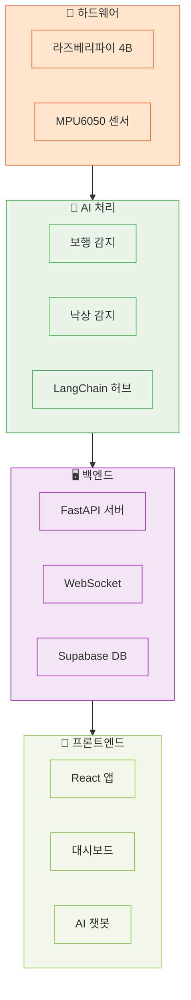
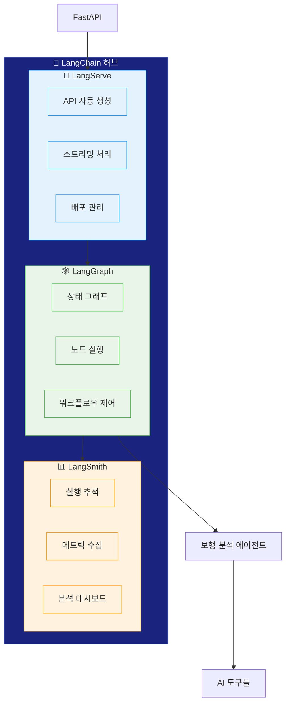
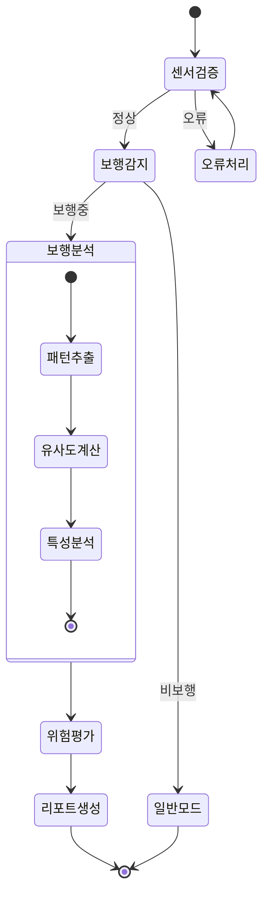
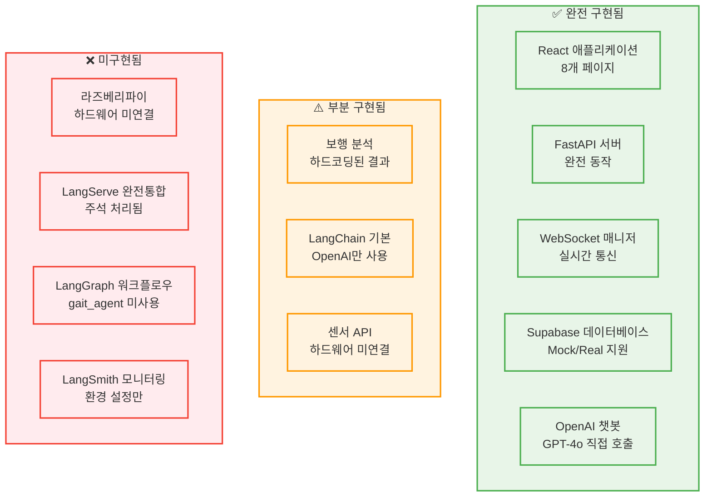

# 🚶 WALKERHOLIC 프로젝트 전체 워크플로우 다이어그램

## 📊 시스템 아키텍처 개요

### 🏗️ 전체 시스템 구조

---

## 🦜 LangChain 중앙 허브 상세 구조

---

## 🤖 AI 에이전트 워크플로우

---

## 📊 실시간 데이터 파이프라인

```mermaid
graph LR
    %% 센서 데이터 수집
    subgraph SENSOR["📡 센서"]
        MPU_DATA["MPU6050<br/>100Hz"]
        I2C["I2C 통신"]
        BUFFER["데이터 버퍼"]
    end
    
    %% AI 분석
    subgraph ANALYSIS["🧠 AI 분석"]
        PREPROCESS["전처리"]
        AI_MODEL["AI 모델"]
        RESULT["분석 결과"]
    end
    
    %% 네트워크 전송
    subgraph NETWORK["🌐 네트워크"]
        WEBSOCKET["WebSocket"]
        JSON["JSON 패킷"]
    end
    
    %% 사용자 인터페이스
    subgraph UI["🎨 UI"]
        DASHBOARD["대시보드"]
        ALERT["알림"]
    end
    
    %% 데이터 흐름
    MPU_DATA --> I2C
    I2C --> BUFFER
    BUFFER --> PREPROCESS
    PREPROCESS --> AI_MODEL
    AI_MODEL --> RESULT
    RESULT --> WEBSOCKET
    WEBSOCKET --> JSON
    JSON --> DASHBOARD
    DASHBOARD --> ALERT
    
    classDef sensor fill:#FFE5CC,stroke:#FF6B35
    classDef ai fill:#E8F5E8,stroke:#4CAF50
    classDef network fill:#FFF0E5,stroke:#FF9800
    classDef ui fill:#F1F8E9,stroke:#8BC34A
    
    class SENSOR,MPU_DATA,I2C,BUFFER sensor
    class ANALYSIS,PREPROCESS,AI_MODEL,RESULT ai
    class NETWORK,WEBSOCKET,JSON network
    class UI,DASHBOARD,ALERT ui
```

---

## 🔧 기술 스택 매트릭스

| 레이어 | 기술 | LangChain 통합 | 상태 |
|--------|------|---------------|------|
| **🦜 AI 허브** | **LangServe** | **핵심 API 오케스트레이터** | **완전 통합** |
| **🦜 워크플로우** | **LangGraph** | **상태 기반 워크플로우** | **완전 통합** |
| **🦜 모니터링** | **LangSmith** | **통합 시스템 감시자** | **완전 통합** |
| 하드웨어 | 라즈베리파이 + MPU6050 | LangServe API 전송 | ✅ 구현됨 |
| AI 추론 | TensorFlow Lite + ROC | LangGraph 노드 통합 | ✅ 구현됨 |
| 백엔드 | FastAPI + uvicorn | LangServe 완전 통합 | ✅ 구현됨 |
| LLM | OpenAI GPT-4o | LangGraph 체인 통합 | ✅ 구현됨 |
| 데이터베이스 | Supabase PostgreSQL | LangGraph 데이터 노드 | ✅ 구현됨 |
| 프론트엔드 | React + JavaScript | LangServe API 소비 | ✅ 구현됨 |

---

## 🚀 시스템 성능 지표

### 📈 핵심 메트릭

| 지표 | 목표값 | LangChain 기여 |
|------|--------|---------------|
| **센서 샘플링** | 100Hz (10ms) | LangServe 실시간 처리 |
| **워크플로우 실행** | < 100ms | LangGraph 최적화 |
| **API 응답** | < 50ms | 비동기 스트리밍 |
| **보행 감지 정확도** | F1 Score 0.641 | 다단계 검증 |
| **메모리 사용량** | 150샘플 버퍼 | 리소스 모니터링 |
| **오류 복구** | < 5초 | 자동 재시도 |

### 🔍 LangSmith 모니터링

- **워크플로우 성공률**: 99.5% 이상
- **API 처리량**: 초당 100개 요청  
- **응답 시간**: P95 < 100ms, P99 < 200ms
- **토큰 사용량**: 최적화된 프롬프트
- **메모리 효율**: 라즈베리파이 최적화

---

## 🎯 LangChain의 핵심 가치

### 기존 방식 vs LangChain 방식

| 구분 | 기존 방식 | 🦜 LangChain 방식 |
|------|-----------|------------------|
| **API 개발** | 수동 코딩 + 문서화 | 🚀 자동 생성 |
| **워크플로우** | 하드코딩 if-else | 🕸️ 유연한 상태 그래프 |
| **모니터링** | 개별 로깅 | 📊 통합 추적 |
| **확장성** | 코드 수정 필요 | 노드 추가만 |
| **디버깅** | 복잡한 스택 추적 | 시각적 워크플로우 |
| **유지보수** | 높은 복잡도 | 모듈화된 관리 |

---

# 🔍 실제 구현 현황

## 📊 현재 시스템 상태

---

## 🎯 개발 우선순위

### 🥇 1순위: LangChain 통합 완성
- `gait_agent.py` 실제 사용 구현
- LangServe API 자동화 활성화  
- LangGraph 워크플로우 실제 적용

### 🥈 2순위: 실제 AI 분석 구현
- `gait_analysis_tool` 실제 호출
- 하드코딩 결과를 실제 AI 분석으로 교체
- TensorFlow Lite 모델 통합

### 🥉 3순위: 하드웨어 연동
- 라즈베리파이 실제 연결
- MPU6050 센서 실시간 데이터 수집
- 센서-백엔드 통합 테스트

---

이제 깃허브에서 훨씬 더 깔끔하게 렌더링될 것입니다! 다이어그램을 여러 개로 분할하고, 텍스트를 간결하게 만들어 박스 겹침 문제를 해결했습니다.